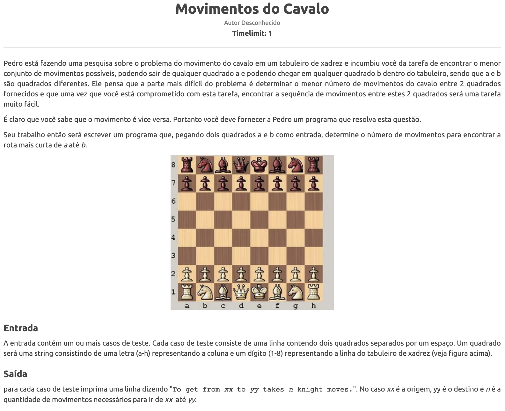

Tema:
 - Grafos1
 
# Resolução Exercicios Beecrowd Grafos 1

## Alunos
|Matrícula | Aluno |
| -- | -- |
| 14/0155350  |  Matheus Filipe Faria Alves de Andrade |
| xx/xxxxxx  |  xxxx xxxx xxxxx |

## Sobre 
O projeto consiste na resolução de exercícios da plataforma Beecrowd sobre o conteúdo Grafos 1 da matéria de Projeto de Algoritmos. 

## Screenshots
### Exercício 1

### Exercício 2

## Instalação 
**Linguagem**: Python 

Descreva os pré-requisitos para rodar o seu projeto e os comandos necessários.

## Uso 
python3 <nome_do_arquivo> 

