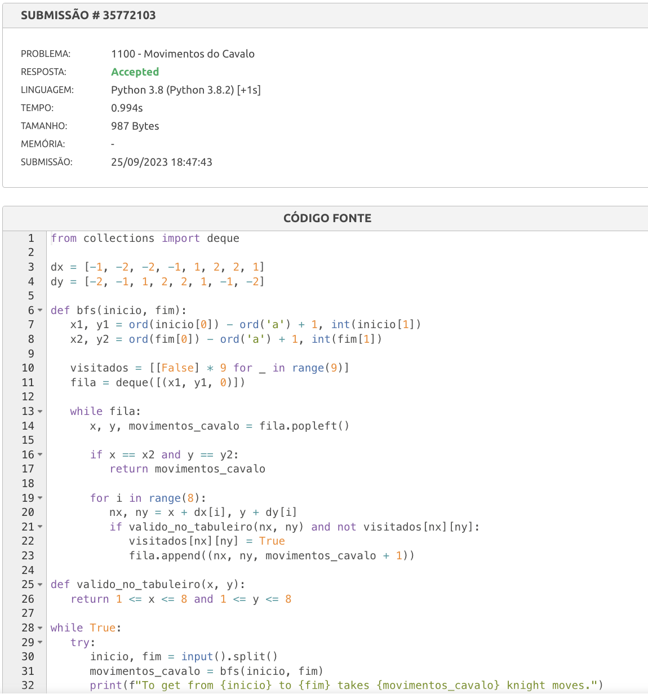

Tema:
 - Grafos1
 
# Resolução Exercicios Beecrowd Grafos 1

## Alunos
|Matrícula | Aluno |
| -- | -- |
| 14/0146156 |  João Victor Lustosa Braz |
| 14/0155350  |  Matheus Filipe Faria Alves de Andrade |

## Sobre 
O projeto consiste na resolução de 4 exercícios sobre o conteúdo Grafos 1 da matéria de Projeto de Algoritmos. 

#### Exercício 1: https://www.beecrowd.com.br/judge/pt/problems/view/1082

#### Exercício 2: https://www.beecrowd.com.br/judge/pt/problems/view/1100

#### Exercício 3: https://www.hackerrank.com/challenges/the-quickest-way-up/problem#

#### Exercício 4: https://www.hackerrank.com/challenges/torque-and-development/problem

## Soluções/Submissões
### Exercício 1

### Exercício 2

### Exercício 3

### Exercício 4

## Instalação 
**Linguagem**: Python 

Descreva os pré-requisitos para rodar o seu projeto e os comandos necessários.

## Uso 
python3 <nome_do_arquivo.py> 

## Apresentação

A arquivo da apresentação se encontra nesse repositório.

